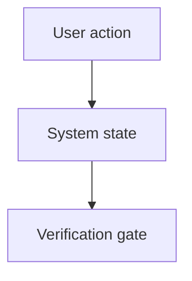

# Visual Plan

Use this skill when a normal chat plan would be too lossy. The output should be
an inspectable artifact: a plan a second agent, reviewer, or Kevin can skim,
challenge, and execute without reconstructing the context from chat.

This is Kevin's local route for the BuilderIO `/visual-plan` pattern. The
reference page is `wiki/tools/builderio-skills.md`; upstream source is
`BuilderIO/skills` (HEAD checked 2026-06-29:
`6c31f2188f87d4afdc38c14c3af8bed2088e4558`).

## When This Fires

- A feature or refactor touches multiple screens, services, agents, or states.
- Kevin asks for a visual plan, storyboard, flow map, system diagram, or
  inspectable implementation plan.
- The next executor may be a different model and needs a self-contained artifact.
- A UI change needs planned states before code: loading, empty, error, success,
  mobile, desktop, and edge cases.

## Hard Boundaries

- Read and plan first. Do not implement while producing the visual plan.
- Keep claims grounded in files, docs, screenshots, or explicit user input.
- Use diagrams to clarify structure, not to decorate.
- If current source facts are version-sensitive, verify them before naming APIs.

## Procedure

1. Read the repo entry docs and the smallest set of files needed to understand
   the requested change.
2. Identify the invariant: what must remain true after the work lands.
3. Produce the plan in this structure:
   - **Intent**: one paragraph with the job-to-be-done.
   - **Current Surface Map**: files, screens, routes, APIs, data stores.
   - **Flow Diagram**: Mermaid when useful.
   - **Storyboard**: user-visible states in order.
   - **Implementation Slices**: small vertical steps with verification after each.
   - **Risk Register**: what can break and how to catch it.
   - **Verification Gates**: exact commands, browser checks, and acceptance criteria.
   - **Open Questions**: only questions that block correctness.
4. If the plan is durable or should be handed to another agent, save it under
   `plans/visual-plans/<yyyy-mm-dd>-<slug>.md`. Otherwise return it in chat.

## Diagram Rules

Prefer Mermaid diagrams for flows and dependencies:

Use screenshots only when the visual surface is the core ambiguity. Annotate
screenshots in prose; do not depend on visual inspection alone.

## Output Standard

A good visual plan makes the work smaller. It names the slice boundaries,
removes ambiguous UI states, gives a second agent enough context to execute,
and gives the reviewer objective gates to reject incomplete work.
